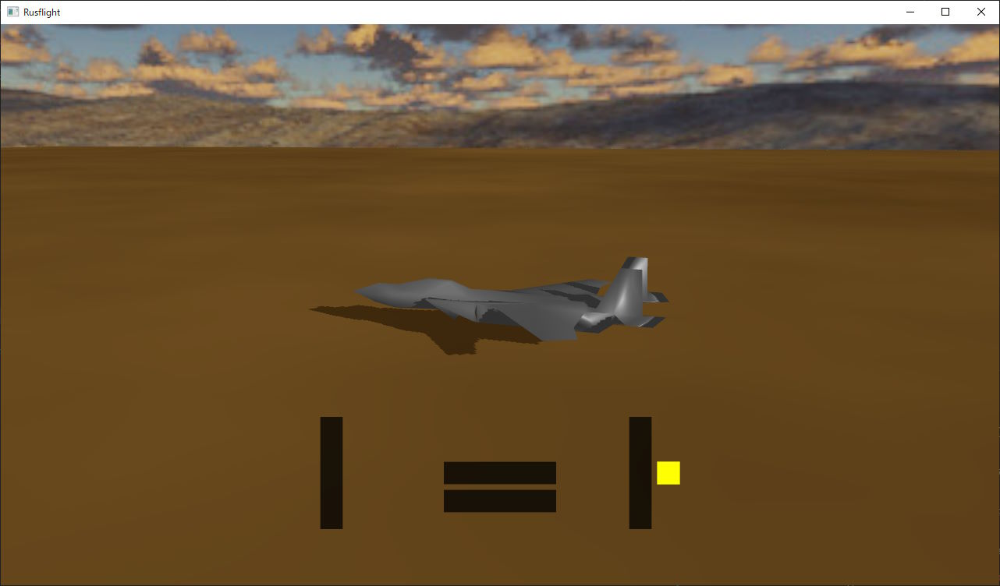

# rusflight

A flight simulator in Rust, using [three-d](https://github.com/asny/three-d) and [rapier3d](https://github.com/dimforge/rapier).

## Controls

* Q, Z - increase/decrease thrust
* A, D - left/right aileron
* W, S - up/down elevator
* X, C - left/right rudder

## Simulation model

It uses aerodynamic tensors and control surfaces, similar to [VastSpace](https://github.com/msakuta/VastSpace).
